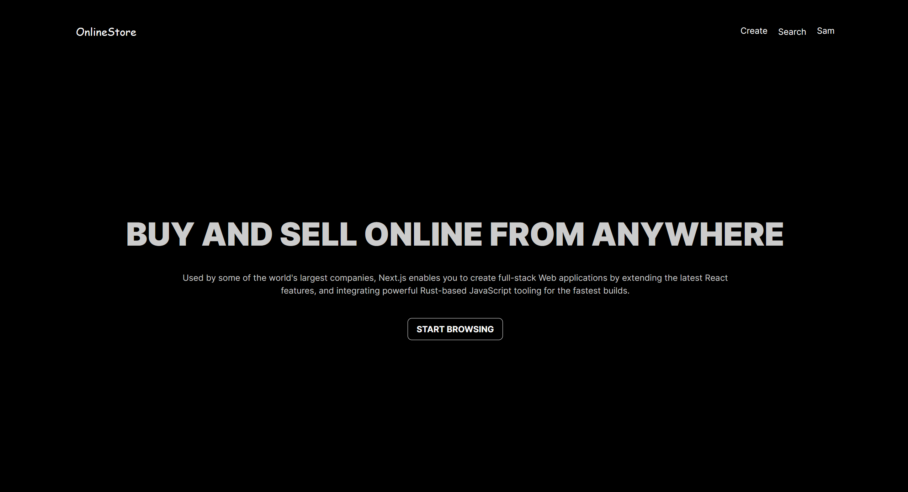
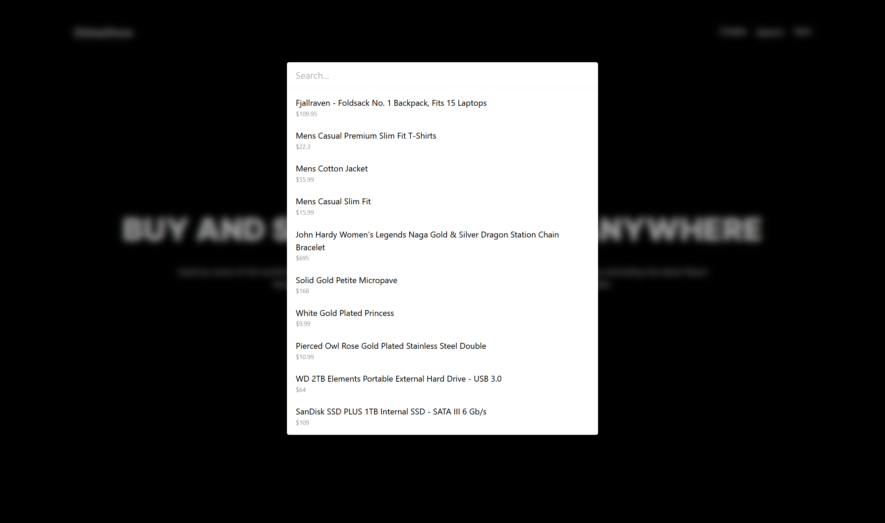

## Installation
To get started with OnlineStore, follow these steps:

1. Clone the repository:
```
git clone https://github.com/SamShr12/OnlineStore
```
2. Install required dependencies:
```
npm install
```
3. Start the development environment:
```
npm run dev
```

##Project Images



